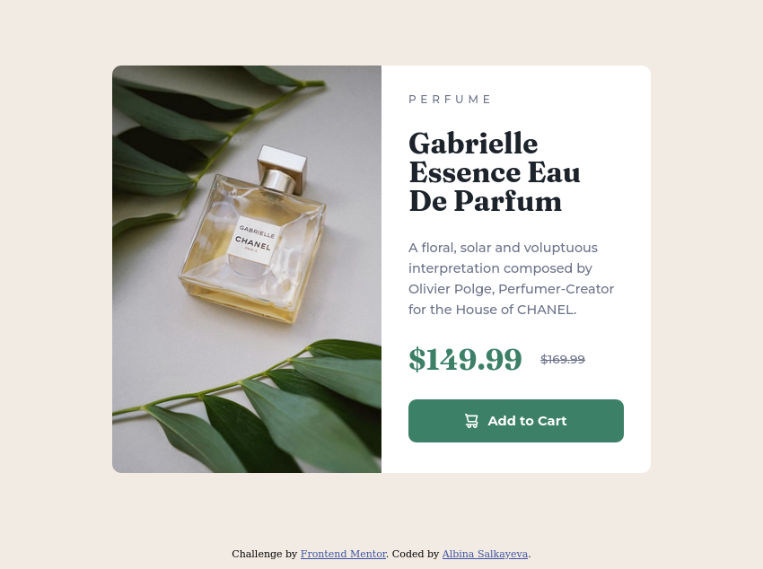
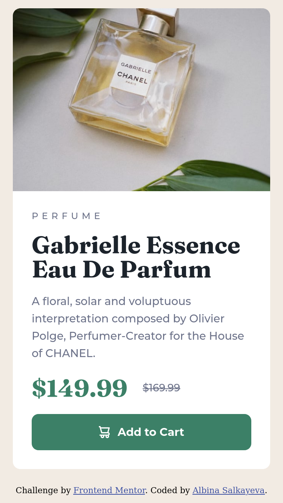

# Frontend Mentor - Product preview card component solution

This is a solution to the [Product preview card component challenge on Frontend Mentor](https://www.frontendmentor.io/challenges/product-preview-card-component-GO7UmttRfa). Frontend Mentor challenges help you improve your coding skills by building realistic projects. 

## Table of contents

- [Overview](#overview)
  - [The challenge](#the-challenge)
  - [Screenshots](#screenshots)
  - [Links](#links)
- [My process](#my-process)
  - [Built with](#built-with)
  - [What I learned](#what-i-learned)
  - [Useful resources](#useful-resources)
- [Author](#author)

## Overview

### The challenge

Users should be able to:

- View the optimal layout depending on their device's screen size
- See hover and focus states for interactive elements

### Screenshots

|Desktop|Mobile|
|:-:|:-:|
|||

### Links

- Solution URL: [github.com/albina0104/product-preview-card-component](https://github.com/albina0104/product-preview-card-component)
- Live Site URL: [albina0104.github.io/product-preview-card-component/](https://albina0104.github.io/product-preview-card-component/)

## My process

### Built with

- Semantic HTML5 markup
- CSS custom properties
- Flexbox

### What I learned

- How to make an image cover all of the parent element:

```css
.card__img {
    width: 100%;
    height: 100%;
    object-fit: cover;
}
```

Also if a parent element has rounded corners, we have to use `overflow: hidden;` on the parent element in order to hide sharp corners of the image.

- When we add a hover effect to an element in CSS, it sticks on touch devices. This article ([How to prevent sticky hover effects for buttons on touch devices?](https://www.geeksforgeeks.org/how-to-prevent-sticky-hover-effects-for-buttons-on-touch-devices/)) helped me to solve the issue with a CSS media query. This adds a hover effect only on devices that support hover; no hover effect is applied on touch devices:

```css
@media (hover: hover) {
    .btn:hover {
        background-color: var(--darker-cyan);
    }
}
```

### Useful resources

- [How to name css classes](http://bdavidxyz.com/blog/how-to-name-css-classes/) - This article helped me to choose names for my classes. I really liked some pieces of advice from this article and will use them going forward. Especially these:
  - "Put the class name at the lowest possible level" is really useful advice, and the linked [article](https://css-tricks.com/strategies-keeping-css-specificity-low/#article-header-id-3) explaining why.
  - BEM naming convention is a good idea: "double dash" means variation of the element, "double underscore" means children of the element.

## Author

- Frontend Mentor - [@albina0104](https://www.frontendmentor.io/profile/albina0104)
- GitHub - [albina0104](https://github.com/albina0104)
